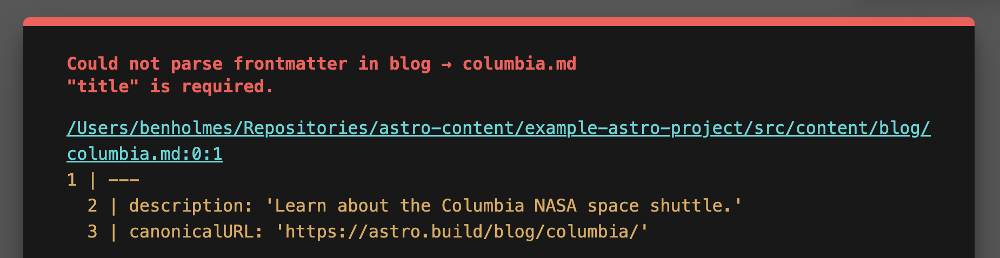

- Start Date: 2022-10-14
- Reference Issues: https://github.com/withastro/astro/issues/4307#issuecomment-1277978007
- Implementation PR:

# Summary

Content Schemas are a way to fetch Markdown and MDX frontmatter in your Astro projects in a consistent, performant, and type-safe way.

This introduces three new concepts:
- A new, reserved directory that Astro will manage: `src/content/`
- A set of helper functions to load entries and collections of entries from this directory
- The introduction of "collections" and "schemas" ([see glossary](#glossary)) to type-check frontmatter data

## Out of scope

**⚠️ This RFC is focused on frontmatter parsing only.** This means any helpers described will _not_ help you **import** and **render** Markdown and MDX components.

We recognize this is a blocker to using any helpers described when you need to render a post's contents, as with `getStaticPaths`. This will be investigated separately, and we will _not_ PR or ship any features described until we find a solution to rendering your content in a performant way.

# Glossary

We'll be using the words "schema," "collection," and "entry" throughout. Let's define those terms in the context of this RFC:

- **Schema:** a way to codify the "structure" of your frontmatter data
- **Collection:** a set of data (in this case, Markdown and MDX files) that share a common schema
- **Entry:** A Markdown or MDX file belonging to a given collection

# Example

Say we want to store our `blog` as a collection of Markdown and MDX documents, with consistent frontmatter throughout. We can create a `blog` directory inside of `src/content` like so with a `~schema.ts` file:

```sh
src/content/
  blog/
    enterprise.md
    columbia.md
    endeavour.md
    ~schema.ts
```

This `~schema.ts` will export a [Zod object](https://github.com/colinhacks/zod) to enforce frontmatter property types and specify optional vs. required:

```ts
// ~schema.ts
import { z } from 'zod'

export const schema = z.object({
  title: z.string(),
  slug: z.string(),
  // mark optional properties with `.optional()`
  image: z.string().optional(),
  tags: z.array(z.string()),
  // transform to another data type with `transform`
  // ex. convert date strings to Date objects
  publishedDate: z.string().transform((str) => new Date(str)),
});
```

To use this `blog/` collection your project, you can call `fetchContent` and/or `fetchContentByEntry` like so:

```astro
---
// We'll talk about that `.astro` in the Detailed Design :)
import { fetchContent, fetchContentByEntry } from '.astro';

// Get all `blog` entries
const allBlogPosts = await fetchContent('blog');
// Filter blog posts by frontmatter properties
const spaceRelatedBlogPosts = await fetchContent('blog', (data) => {
  return data.tags.includes('space');
});
// Get a specific blog post by file name
const enterprise = await fetchContentByEntry('blog', 'enterprise.md');
---

<ul>
  {allBlogPosts.map(post => (
    <li>
      {/* access frontmatter properties with `.data` */}
      <a href={post.data.slug}>{post.data.title}</a>
      {/* each property is type-safe, */}
      {/* so expect nice autocomplete and red squiggles here! */}
      <time datetime={post.data.publishedDate.toISOString()}>
        {post.data.publishedDate.toDateString()}
      </time>
    </li>
  ))}
</ul>
```

See [detailed usage](#detailed-usage) for a breakdown of each feature.

# Motivation

There are two major problems this RFC addresses:

## Frontmatter should be easy to use and debug

First problem: **enforcing consistent frontmatter across your content is a lot to manage.** You can define your own types with a type-cast using `Astro.glob` today:

```astro
---
import type { MarkdownInstance } from 'astro';

const posts: MarkdownInstance<{ title: string; ... }> = await Astro.glob('./blog/**/*.md');
---
```

However, there's no guarantee your frontmatter _actually_ matches this `MarkdownInstance` type.

Say `blog/columbia.md` is missing the required `title` property. When writing a landing page like this:

```astro
...
<ul>
  {allBlogPosts.map(post => (
    <li>
      {post.frontmatter.title.toUpperCase()}
    </li>
  ))}
</ul>
```

...You'll get the ominous error "cannot read property `toUpperCase` of undefined." Stop me if you've had this monologue before:

> _Aw where did I call `toUpperCase` again?_
> 
> _Right, on the landing page. Probably the `title` property._
>
> _But which post is missing a title? Agh, better add a `console.log` and scroll through here..._
>
> _Ah finally, it was post #1149. I'll go fix that._

**Authors shouldn't have to think like this.** What if instead, they were given a readable error pointing to where the problem is?



This is why schemas are a _huge_ win for a developer's day-to-day. Astro will autocomplete properties that match your schema, and give helpful errors to fix properties that don't.

## Importing globs of content can be slow

Second problem: **importing globs of content via `Astro.glob` [can be slow at scale.](https://github.com/withastro/astro/issues/4307#issuecomment-1277978007)** This is due to a fundamental flaw with importing: even if you _just_ need the frontmatter of a post, you still wait on the _content_ of that post to render as well. Though less of a problem with Markdown, globbing hundreds-to-thousands of MDX entries can add minutes to your build.

To avoid this, content schemas are **just** focused on processing and returning a post's frontmatter, **not** the post's contents. This should make Markdown and MDX equally quick to process, and should make landing pages quick to build and debug.

> ⚠️ **Note:** We also intend to tackle performant rendering of Markdown and MDX globs in a separate RFC. [See out-of-scope section](#out-of-scope) for more.

# Detailed usage

As you might imagine, Content Schemas have a lot of moving parts. Let's detail each one:

## The `src/content/` directory

This RFC introduces a new, reserved directory for Astro to manage: `src/content/`. This directory is where all collections and schema definitions live.

### Creating a collection

All entries in `src/content/` **must** be nested in a "collection" directory. This allows you to group content based on the schema their frontmatter should use. This is similar to creating a new table in a database, or a new content model in a CMS like Contentful.

What this looks like in practice:

```shell
src/content/
  newsletters/
    # All newsletters have the same frontmatter properties
    ~schema.ts 
    week-1.md
    week-2.md
    week-3.md
  blog/
    # All blog posts have the same frontmatter properties
    ~schema.ts
    columbia.md
    enterprise.md
    endeavour.md
```

### Adding a schema

To add type checking to a given collection, you can add a `~schema.{js|mjs|ts}` file inside of that collection directory. This file should:
1. Have a single named export called `schema`
2. Use a [Zod object](https://github.com/colinhacks/zod#objects) to define frontmatter properties

For instance, say every `blog/` entry should have a `title`, `slug`, a list of `tags`, and an optional `image` url. We can specify each object property like so:

```ts
// ~schema.ts
import { z } from 'zod'

export const schema = z.object({
  title: z.string(),
  slug: z.string(),
  // mark optional properties with `.optional()`
  image: z.string().optional(),
  tags: z.array(z.string()),
});
```

[Zod](https://github.com/colinhacks/zod) has some benefits over TypeScript as well. Namely, you can check the _shape_ of string values with built-in regexes, like `url()` for URLs and `email()` for emails.

```ts
export const schema = z.object({
  // "jeff" would fail to parse, but "hey@blog.biz" would pass
  authorContact: z.string().email(),
  // "/post" would fail, but `https://blog.biz/post` would pass
  canonicalURL: z.string().url(),
  tags: z.array(z.string()),
});
```

You can [browse Zod's documentation](https://github.com/colinhacks/zod) for a complete rundown of features. However, given frontmatter is limited to primitive types like strings and booleans, we don't expect users to dive _deep_ into Zod's complex use cases.

### Fetching content

Astro provides 2 functions to query collections:
- `fetchContent` - get all entries in a collection, or based on a frontmatter filter
- `fetchContentByEntry` - get a specific entry in a collection by file name

These functions will have typed based on collections that exist. In other words, `fetchContent('banana')` will raise a type error if there is no `src/content/banana/`.

```astro
---
import { fetchContent, fetchContentByEntry } from '.astro';
// Get all `blog` entries
const allBlogPosts = await fetchContent('blog');
// Filter blog posts by frontmatter properties
const spaceRelatedBlogPosts = await fetchContent('blog', (data) => {
  return data.tags.includes('space');
});
// Get a specific blog post by file name
const enterprise = await fetchContentByEntry('blog', 'enterprise.md');
---
```

### Return type

Assume the `blog` collection schema looks like this:

```ts
// src/content/blog/~schema.ts
import { z } from 'zod'

export const schema = z.object({
  title: z.string(),
  slug: z.string(),
  image: z.string().optional(),
  tags: z.array(z.string()),
});
```

`await fetchContent('blog')` will return entries of the following type:

```ts
{
  // parsed frontmatter
  data: {
    title: string;
    slug: string;
    image?: string;
    tags: string[];
  };
  // raw body of the Markdown or MDX document
  body: string;
}
```

Note that `body` is the _raw_ content of the file. This ensures builds remain performant by avoiding expensive rendering pipelines. However, we recognize the value of parsing this body automatically as `Astro.glob` does today. See [out of scope](#out-of-scope) for future investigations planned.

# Detailed design

To wire up type inferencing in those `fetchContent` helpers, we'll need to generate some code under-the-hood. Let's explore the engineering work required.

## Generated `.astro` directory

We plan to treat `src/content/` as a separate directory managed by Astro, rather than the Vite pipeline, your `markdown` config, or other external factors. This escapes the `import` pipeline that slows to Markdown and MDX globbing at scale today.

All generated code will be added to a new directory in your project: `.astro`.
// TODO: detail here!

## Manifest

We will generate our own manifest of `src/content/` entries at build time (for the dev server, static builds, _and_ SSR). This will define:
- All of the collections in `src/content/`
- The schema types used by each collection
- The parsed frontmatter object and raw content body for each entry in a collection

The generated manifest may look like this (NOT final):

```ts
// src/.astro/content-manifest.mjs
export const contentMap = {
  "blog": {
    "columbia.md": '/Users/me/my-astro-project/src/content/columbia.md',
    "endeavour.md": '/Users/me/my-astro-project/src/content/endeavour.md',
    "enterprise.md": '/Users/me/my-astro-project/src/content/enterprise.md',
  },
};
export const contentMetadataMap = new Map([
  [contentMap["blog"]["columbia.md"], {
    data: {"description":"Learn about the Columbia NASA space shuttle.","canonicalURL":"https://astro.build/blog/columbia/","publishedDate":"Sat May 21 2022 00:00:00 GMT-0400 (Eastern Daylight Time)","modifiedDate":"Sun May 22 2022 00:00:00 GMT-0400 (Eastern Daylight Time)"},
    body: "Space Shuttle Columbia...",
  }],
  [contentMap["blog"]["endeavour.md"], {
    data: {"description":"Learn about the Endeavour NASA space shuttle.","canonicalURL":"https://astro.build/blog/endeavour/","publishedDate":"Sat May 21 2022 00:00:00 GMT-0400 (Eastern Daylight Time)","modifiedDate":"Sun May 22 2022 00:00:00 GMT-0400 (Eastern Daylight Time)"},
    body: "Space Shuttle Endeavour (Orbiter Vehicle Designation: OV-105) is a retired orbiter...",
  }],
  [contentMap["blog"]["enterprise.md"], {
    data: {"description":"Learn about the Enterprise NASA space shuttle.","canonicalURL":"https://astro.build/blog/enterprise/","publishedDate":"Sat May 21 2022 00:00:00 GMT-0400 (Eastern Daylight Time)","modifiedDate":"Sun May 22 2022 00:00:00 GMT-0400 (Eastern Daylight Time)"},
    body: "Space Shuttle Enterprise (Orbiter Vehicle Designation: OV-101) was the first orbiter...",
  }],
]);
```

**Note:** The user is _not_ expected to view or edit this manifest. This only exists to enable type checking and frontmatter parsing via `fetchContent` and `fetchContentByEntry`.

## `fetchContent` and `fetchContentByEntry`

Alongside this manifest, we will expose `fetchContent` and `fetchContentByEntry` helpers. Users will import these helpers from the `.astro` directory like so:

```astro
---
// src/pages/index.astro
import { fetchContent, fetchContentByEntry } from '.astro'
---
```

`.astro` will be aliased to the `.astro` directory generated at the base of your project. We hope to apply this alias to your project automatically, though this would be the manual configuration required:

```json
{
  "compilerOptions": {
    "baseUrl": ".",
    "paths": {
      ".astro": [".astro"],
    }
  }
}
```

By avoiding the `Astro` global, these fetchers are framework-agnostic. This unlocks usage in UI component frameworks and endpoint files.

# Drawbacks

By adding structure, we are also adding complexity to your code. This has a few consequences:

1. **[Zod](https://github.com/colinhacks/zod) has a learning curve** compared to writing TypeScript types. We will need to document common uses cases like string parsing, regexing, and transforming to `Date` objects so users can onboard easily. We also consider CLI tools to spin up `schema` entries **vital** to give new users a starting point.
2. **Magic is always scary,** especially given Astro's bias towards being explicit. Introducing a reserved directory with a sanctioned way to import from that directory is a hurdle to adoption.
3. **We (as of this RFC) don't help you render your content.** This means `fetchContent` will _not_ replace `Astro.glob` when rendering content is vital, as with `getStaticPaths`. We consider this a blocker to implementing changes proposed here, and should be answered by a separate investigation.

# Alternatives

## Zod

We considered a few alternatives to using Zod for schemas:
- **Generate schemas from a TypeScript type.** This would let users reuse frontmatter types they already have and avoid the learning curve of a new tool. However, TypeScript is missing a few surface-level features that Zod covers:
  - Constraining the shape of a given value. For instance, setting a `min` or `max` character length, or testing strings against `email` or `URL` regexes.
  - [Transforming](https://github.com/colinhacks/zod#transform) a frontmatter value into a new data type. For example, parsing a date string to a `Date` object, and raising a helpful error for invalid dates.

- **Invent our own JSON or YAML-based schema format.** This would fall in-line with a similar open source project, [ContentLayer](https://www.contentlayer.dev/docs/sources/files/mapping-document-types), that specifies types with plain JS. Main drawbacks: replacing one learning curve with another, and increasing the maintenance cost of schemas overtime.

In the end, we've chosen Zod since it can scale to complex use cases and takes the maintenance burden off of Astro's shoulders.

We have also considered exposing the `z` helper as an `astro` dependency rather than a separate `zod` dependency to install in your project:

```ts
import { z } from 'astro';
```

This would allow us to version-lock Zod to avoid incompatibility in the future, and make Zod feel more official as a solution.

## Collections vs. globs

We expect most users to compare `fetchContent` with `Astro.glob`. There is a notable difference in how each will grab content:
- `Astro.glob` accepts wild cards (i.e. `/posts/**/*.md) to grab entries multiple directories deep, filter by file extension, etc.
- `fetchContent` accepts **a collection name only,** with an optional filter function to filter by frontmatter values.

The latter limits users to fetching a single collection at a time, and removes nested directories as an option. One alternative could be to [mirror Contentlayer's approach](https://www.contentlayer.dev/docs/sources/files/mapping-document-types#resolving-document-type-with-filepathpattern), wiring schemas to wildcards of any shape:

```ts
// Snippet from Contentlayer documentation
// https://www.contentlayer.dev/docs/sources/files/mapping-document-types#resolving-document-type-with-filepathpattern
const Post = defineDocumentType(() => ({
  name: 'Post',
  filePathPattern: `posts/**/*.md`,
  // ...
}))
```

Still, we've chosen a flat `collection` + schema file approach to mirror Astro's file-based routing.

# Adoption strategy

# Unresolved questions
